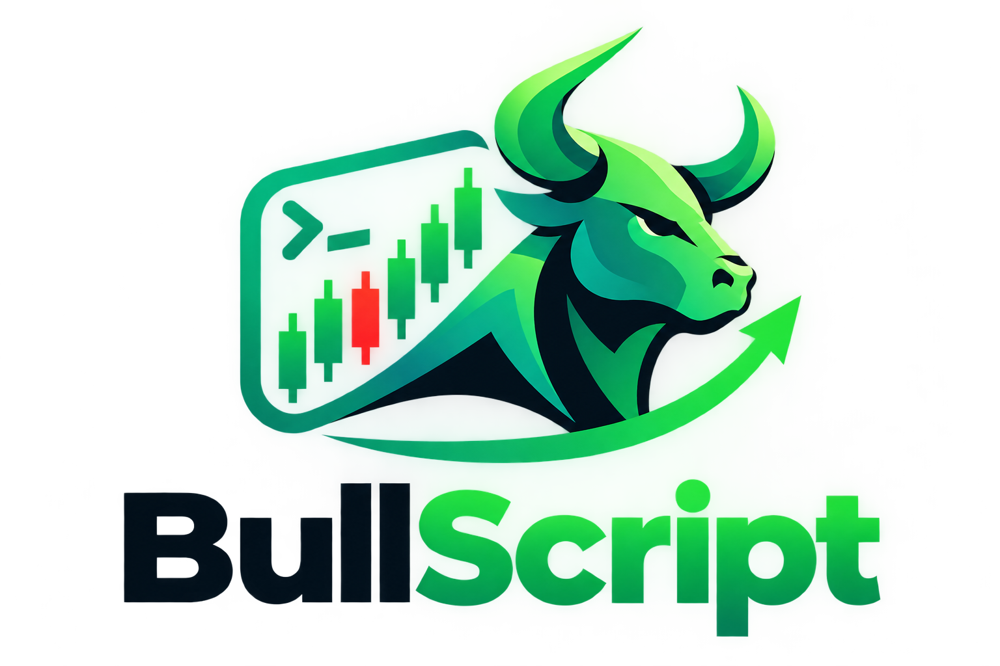

# BullScript

Real-time stock market analytics platform with a self-training ML forecasting
engine and Hugging Face FinBERT news sentiment analysis.



## Architecture

```
bullscript/
├── backend/          FastAPI + ML engine (Python 3.10+)
│   ├── app/
│   │   ├── api/v1/       REST endpoints
│   │   ├── ml/           features, sentiment, self-training pipeline, forecaster
│   │   ├── services/     market data fetching (yfinance)
│   │   ├── core/         background scheduler
│   │   └── models/       Pydantic schemas
│   ├── data/models/      persisted model binaries + retrain logs (gitignored)
│   └── main.py
└── frontend/         React + TypeScript + Tailwind (Vite)
    └── src/
        ├── components/   Navbar, Dashboard, PredictionChart, ModelDiagnostics, SentimentCard
        ├── api/          typed API client
        └── types/        shared TS types
```

## Backend setup

```bash
cd backend
python3 -m venv .venv && source .venv/bin/activate
pip install -r requirements.txt
cp .env.example .env
uvicorn main:app --reload --port 8000
```

First request to `/prediction` or `/model/retrain` for a symbol will lazily
train and persist that symbol's models under `backend/data/models/`.

### API endpoints

| Method | Path | Description |
|---|---|---|
| GET | `/api/v1/ticker/{symbol}/chart` | OHLCV history + technical indicators |
| GET | `/api/v1/ticker/{symbol}/prediction` | 5d/14d/30d forecast with confidence bands |
| GET | `/api/v1/ticker/{symbol}/sentiment` | FinBERT news sentiment breakdown |
| GET | `/api/v1/model/diagnostics` | Model versions, metrics, retrain history |
| POST | `/api/v1/model/retrain` | Manually trigger a retrain for a symbol |

## Frontend setup

```bash
cd frontend
npm install
npm run dev
```

The dev server proxies `/api/*` to `http://localhost:8000` (see `vite.config.ts`).

## Self-training loop

`backend/app/core/scheduler.py` runs an APScheduler job every
`BULLSCRIPT_RETRAIN_CHECK_INTERVAL_MINUTES` (default 60) that re-evaluates
every tracked `(symbol, horizon)` model pair against fresh data. If RMSE/MAPE
drift past the configured thresholds, a challenger model is trained on a
sliding window and promoted automatically if it outperforms the incumbent.
Every evaluation — promoted or not — is appended to
`backend/data/models/retrain_log.jsonl` and surfaced via
`GET /api/v1/model/diagnostics`.

## Design system

| Token | Value |
|---|---|
| Background | `#0B0E11` / `#0D0F12` |
| Card | `#161A22`, border `#1E262C` |
| Bullish accent | `#00E676` → `#00C853` |
| Bearish accent | `#FF3B30` / `#FF5252` |
| Text | `#FFFFFF` primary, `#8A99AD` secondary |
